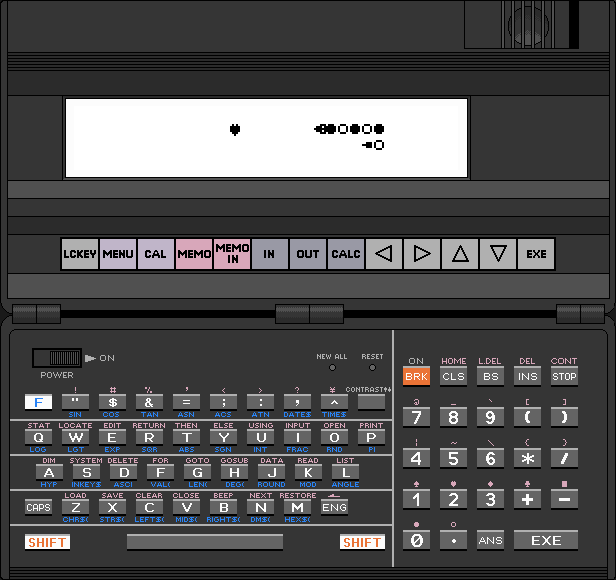

The Basic code found in the `snake` and `optimized` files can be run and tested with the pb-1000 emulator found [here](http://www.pisi.com.pl/piotr433/pb1000ee.htm).

I have created a python script that automatically writes the code into the emulator.
The script can be found at the `main.py` file.

To use the script, create a Basic file in the emulator, enter programming mode,
run the script, and place your mouse cursor above the shift key in the emulator.